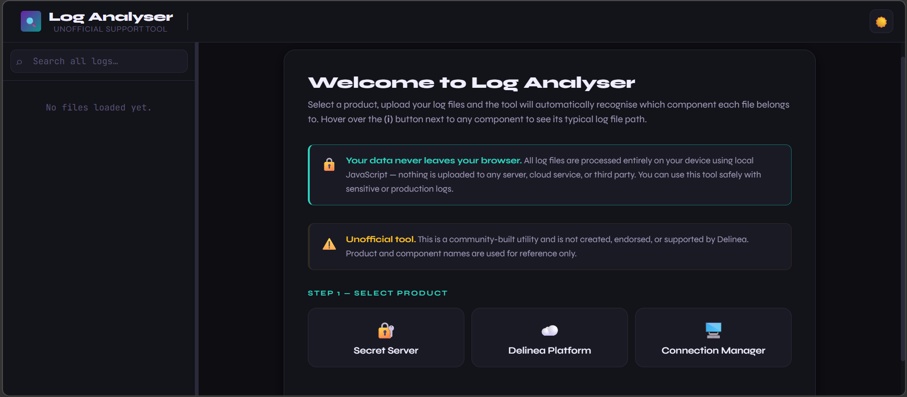
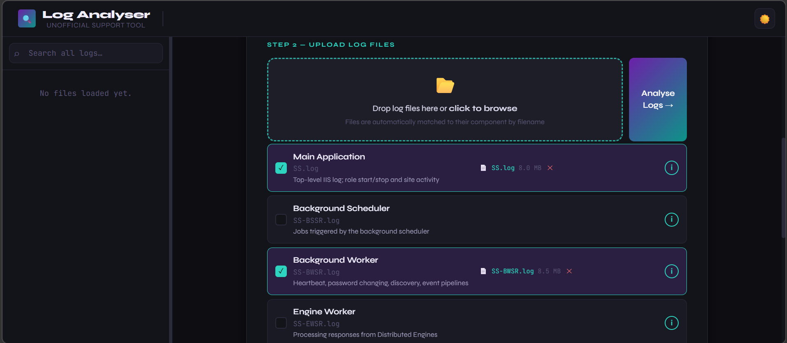
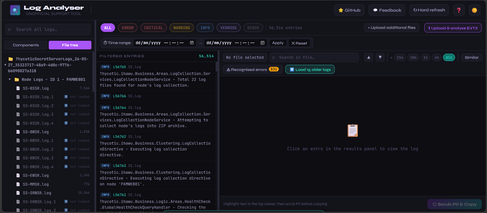
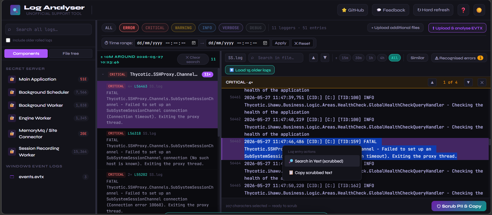
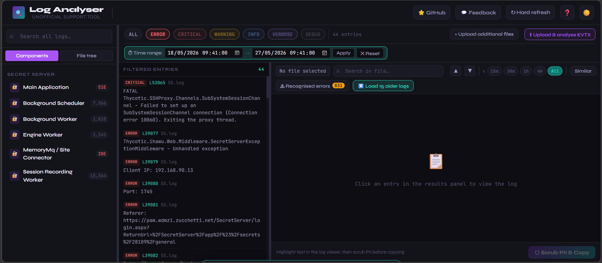
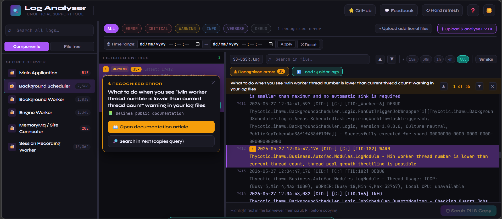
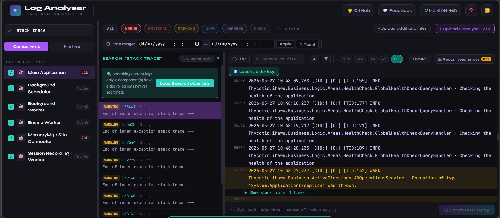
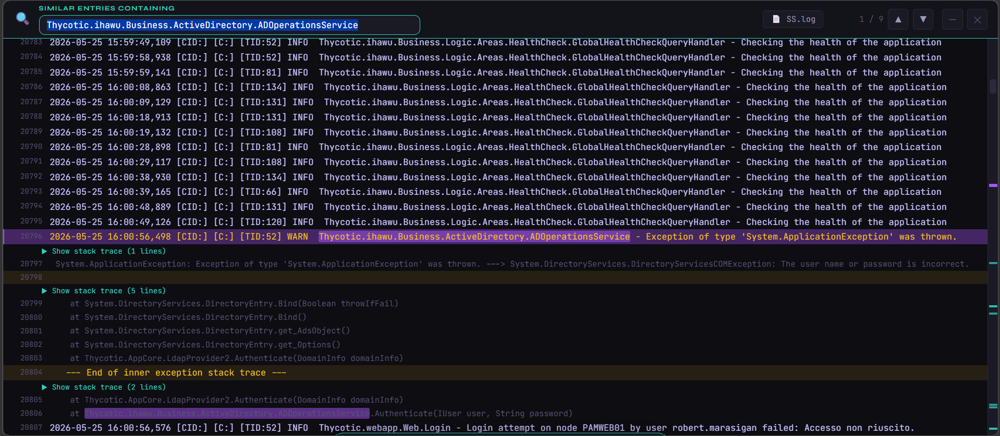
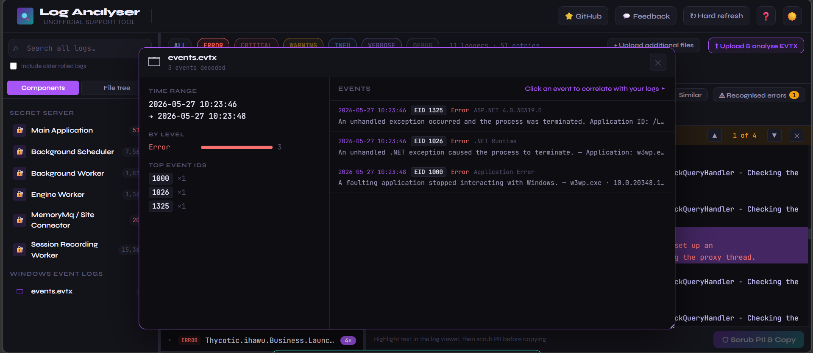

# Log Analyser

🔗 **[https://totalthyco99.github.io/log-analyser/](https://totalthyco99.github.io/log-analyser/)**

A browser-based log analysis tool for Secret Server, Delinea Platform, and Connection Manager. Built for support engineers to quickly parse, filter, search, and inspect log files — without any data leaving the device.

> ⚠️ **Unofficial tool.** This is a community-built utility and is not created, endorsed, or supported by Delinea. Product and component names are used for reference only.

---

## 🔒 Privacy first

**No data ever leaves your browser.** All log files — including `.zip` bundles, whole folders, and Windows `.evtx` event logs — are read, unpacked, and processed entirely on your device using local JavaScript. Nothing is uploaded to any server, cloud service, or third party. It is safe to use with sensitive or production logs, and it works offline once loaded.

---

## Screenshots

### Welcome screen
Select a product to get started. The tool explains what it does, confirms your data never leaves the browser, and notes it is an unofficial utility. A guided tour runs on first visit (replayable any time with the **❓** button) and walks through every feature using sample data.

### Loading files, a zip, or a whole folder
Drop individual log files, an entire `.zip` (including the nested per-node and per-Distributed-Engine zips customers typically send), or a whole folder. Everything is unpacked in the browser and each file is matched to its component automatically by filename — including rolled logs like `SS.log.1`. Matched components highlight in teal with the filename and size shown beneath.

### Sidebar — components & file tree
Loaded components are listed in the sidebar. When a zip or folder is loaded, a toggle lets you switch between the **Components** view and a **File tree** view that mirrors the original folder structure from the bundle.

### Filtering by log level
Use the filter bar to narrow results by **ERROR**, **CRITICAL**, **WARNING**, **INFO**, **VERBOSE**, or **DEBUG**. Results appear in the middle panel with the source file, line number, and a stripped message preview for each entry. Click any entry to jump to it in the log viewer on the right.

### Global time range
Restrict every loaded log to a specific start/end window using the controls beneath the level filters, then **Apply**. This focuses all components on the moment an incident occurred; the reset button clears it instantly.

### Recognised errors
The tool ships with a built-in knowledge base of known Delinea errors. Matching lines show an amber **!** badge linking to the documentation. The **Recognised errors** view lists each distinct known error once with its occurrence count — step through every occurrence with ▲▼, or jump to other components that hit the same error.

### Log viewer — jump to line with full context
Clicking an entry opens the complete log file with the selected line highlighted and centred. The viewer shows the full raw content including stack traces and continuation lines, with colour-coded log levels. Use the **±** buttons to narrow to a window around the entry. The three panels are resizable and your layout is remembered between sessions.

### Similar entries
Click **Similar** to open a full-screen view of every line sharing the same logger string. Edit the term to broaden or narrow it, navigate with ▲▼, and use the scrollbar markers to see where every match sits in the file.

### Windows Event Logs (.evtx)
Click **Upload & analyse EVTX** to add a Windows Event Log at any time. A complete in-browser parser decodes the events — provider, event ID, level, and the real message text — and opens them in a draggable, resizable floating window with a summary (time range, level breakdown, top event IDs) and a browsable event list. **Sync all logs to this time** lines your other logs up around a chosen event so you can see what happened across the whole system at that moment.

### PII scrubbing
Highlight any text in the log viewer, then click **Scrub PII & Copy** in the bottom bar. A preview shows every replacement before anything is copied — IP addresses, `DOMAIN\username` pairs, email addresses, SIDs, GUIDs, UNC paths, and more are replaced with clearly labelled placeholders. A copyable text box is provided as a fallback if the browser blocks clipboard access.

---

## Features

### File loading
- Select a product, then drop **individual files**, a **`.zip`**, or a **whole folder** — everything is unpacked and processed in the browser
- **Nested zips** (a bundle containing a zip per node / per Distributed Engine) are extracted recursively, preserving the original folder structure
- Files are matched to their component automatically by filename — including rolled logs like `SS.log.1`, `SS.log.2`
- **Lazy loading** — only the most recent log per component is parsed up front to keep things fast and memory-light; older rolled files load on demand via **Load older logs**
- **Upload additional files** at any time without losing what you've already loaded
- The **EVTX**, **PCAP**, and **HAR** analysers can also be launched **on their own from the welcome screen** — no log bundle required — if you only need to inspect one of those
- Hover the **ⓘ** button next to any component to see the typical path where that log file lives on the server

### Sidebar — components & file tree
- Loaded components are listed in the sidebar; click one to focus it
- When a zip or folder is loaded, toggle between a **Components** view and a **File tree** view that mirrors the original folder structure

### Filtering and results
- Filter entries by **ERROR**, **CRITICAL**, **WARNING**, **INFO**, **VERBOSE**, or **DEBUG** across all loaded files
- Matching entries are **grouped by logger**, newest activity first, with a total count and a severity breakdown per logger
- Expand a logger to see its entries with identical messages **collapsed and counted**; click one to open it in the viewer and step through every occurrence with ▲▼
- **Right-click any entry** to copy a scrubbed copy of the line, search it in Yext, or pin it to your notes (see *Recognised errors*, *Notes & pinned entries*, and *PII scrubbing*)

### Global time range
- Restrict **every** loaded log to a specific start/end window with a single control
- Ideal for focusing all components on the moment an incident occurred; a reset button clears it instantly

### Recognised errors (knowledge base)
- The tool ships with a built-in dictionary of known Delinea errors sourced from public documentation and internal knowledge
- Lines matching a known error show an amber **!** badge linking straight to the relevant article
- The **Recognised errors** view lists each distinct known error once, showing how many times it occurred; step through every occurrence with ▲▼, or jump to other components that hit the same error
- **Search in Yext** — from a recognised error's badge, or by right-clicking any log line, the tool copies a **PII-scrubbed** copy of the text to your clipboard and opens Yext ready to paste
- **⚠ Recognised errors…** (in **🗒 Notes**) — preview every recognised error found in the currently loaded logs, then optionally add a summary to your note and pin one example of each in a single click

### Log viewer
- Opens the complete log file with the selected entry highlighted and centred
- **Time window** — narrow to ±15 minutes, ±30 minutes, ±1 hour, or ±4 hours around the selected entry
- **Similar entries** — highlight all lines sharing the same logger/component string to trace a specific subsystem
- **Keyword search** — inline search with match counter and ▲▼ navigation between hits
- Stack traces and continuation lines are detected and collapsed by default

### Universal search
- The search bar at the top of the sidebar searches across every loaded log file at once
- Searches current logs by default for speed, with a one-click option to also load and search older rolled files
- Per-component include/exclude toggles let you scope the search

### Windows Event Logs (.evtx)
- Upload a Windows Event Log at any time with **Upload & analyse EVTX**
- Opens in a draggable, resizable floating window with a summary (time range, level breakdown, top event IDs) and a browsable event list
- Clicking an event opens a **movable, closable detail panel** showing its fields in plain language
- **Sync logs to this event** lines your other logs up around a chosen event, and a correlation option pulls entries from ±10/15/20 minutes around it — so you can see what happened across the whole system at that moment
- EVTX parsing runs **entirely in-browser**: a complete Binary XML + template decoder reads provider, event ID, level, channel, and structured event data. Parsing uses a Web Worker where the browser allows it and falls back to the main thread otherwise, so it works on static hosting too
- Documented Windows and .NET event IDs are given **human-readable headline messages** from a built-in template table, with the underlying event data shown beneath

### Network captures (.pcap / .pcapng)
- Upload a packet capture with **Upload & analyse PCAP** — classic pcap, pcapng, and gzipped `.pcap.gz` are all read in the browser
- Opens in a draggable floating window listing each packet's time, protocol, source/destination, length and TCP flags (SYN, RST, FIN…), with DNS detection
- **Filter** by IP, port, protocol or flag
- **Side-by-side with logs** — scroll the packets and a chosen component's logs together, automatically lined up by timestamp; ideal for confirming whether a logged timeout matches a RST, retransmit, or missing handshake on the wire
- Best-effort dissection of Ethernet / IPv4 / IPv6 / TCP / UDP; other link types still list with timing and size

### Browser HARs (.har)
- Upload a browser HTTP archive with **Upload & analyse HAR**
- Lists every request's method, status (colour-coded 2xx/3xx/4xx/5xx), URL, duration and a per-request **timing waterfall** (blocked, DNS, connect, SSL, send, wait, receive)
- **Quick-filter** to errors (4xx/5xx) or slow (≥1s) requests, plus a free-text filter across method, status, host, path and MIME type
- For safety, request and response **headers are never displayed** — HAR files routinely contain auth tokens and cookies

### Cross-component analysis
- **🕒 Cross-component timeline** — merge every loaded component into a single colour-coded chronological stream for the current time range, with an *errors only* toggle; click any entry to jump straight to it in its component's viewer
- **📋 Export findings** — generate a PII-scrubbed support summary (distinct recognised errors with counts, per-component error/critical tallies, active time range, optional EVTX summary) ready to paste into a ticket
- **🌍 Local / UTC toggle** — switch how all timestamps are displayed across the app, so logs, EVTX and captures line up without time-zone drift

### Notes & pinned entries
- **🗒 Notes** opens a persistent, on-device scratchpad — type free-form notes (root-cause theories, timestamps of interest, ticket numbers) and they save automatically as you go
- **📌 Pin this line** — right-click any log line to pin it; each pin records the line text, its timestamp, and the file and folder it came from, so you can find it again even after the logs are gone. Click a pin to jump straight back to it in the viewer
- **Named sessions** — each set of logs you load gets its own note set, named after the zip (or the product and time for loose files), and **🕘 History** reopens the last 10
- **⚠ Recognised errors…** — preview the recognised errors found in the loaded logs and, in one click, append a summary to your note and pin one example of each
- **Copy** or **download** the note and all pinned entries as a text file, with a **scrub toggle** that PII-scrubs the copied/exported text (your stored pins and the logs themselves are never altered)
- Stored only in this browser, on this device — survives reloads and cache-busting, but not a manual "clear site data"

### PII scrubbing
- Highlight any text in the log viewer with your mouse
- The **Scrub PII & Copy** button shows a preview of every replacement before anything is copied
- Patterns scrubbed: IPv4 and IPv6 addresses, email addresses, `DOMAIN\username` pairs, UPNs, Windows SIDs, UNC paths, GUIDs, and key=value username fields
- **Right-click any log line** to copy a scrubbed copy of it, search it in Yext, or pin it to your notes — text sent to the clipboard or to Yext is always scrubbed first
- A copyable text box is provided as a fallback if the browser blocks clipboard access

### Appearance & convenience
- **Light and dark mode** toggle — your preference is remembered
- **Resizable panels** — the sidebar, results, and viewer widths persist between sessions
- **Installable** as a Progressive Web App for quick access
- **Hard refresh** button to clear the cache and pull the latest version, with automatic update detection
- **🩺 Diagnostics** — a privacy-safe troubleshooting panel that collects **metadata and app errors only** (app version, environment, memory, and a timeline of events — never log content, file names, or scrubbed text). View this-session and previous-session records, then copy or download (PII-scrubbed on export) to share with the developer if you hit a problem
- **⭐ GitHub** and **💬 Feedback** buttons for viewing the source or sending ideas and reporting issues

### Privacy
- 100% client-side — log data never leaves your device
- Works offline once loaded
- Safe for sensitive and production logs

---
