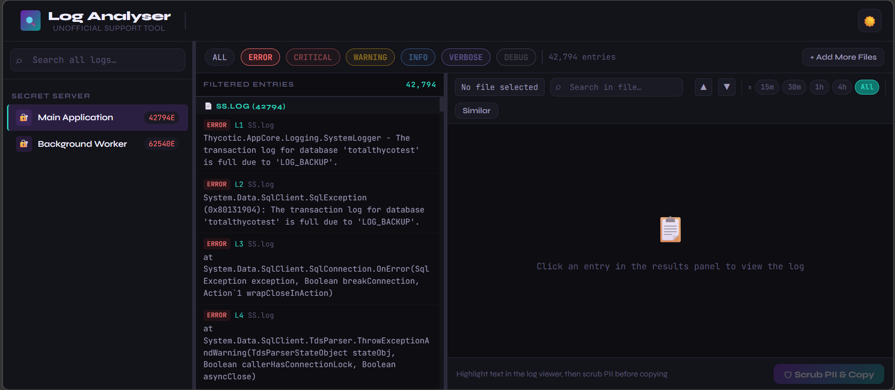
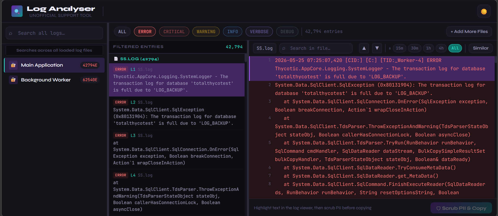
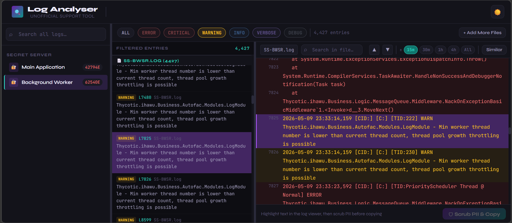
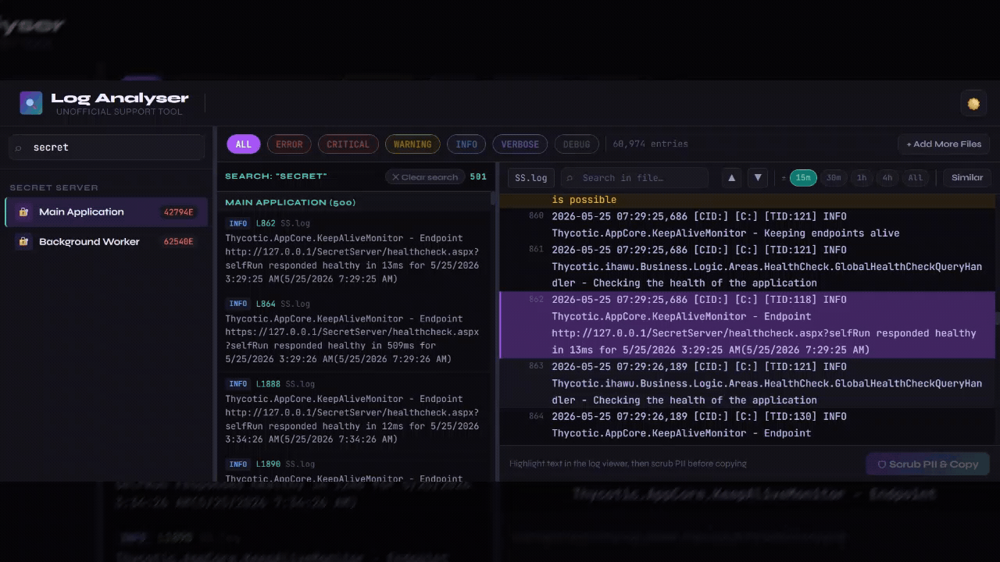

# Log Analyser

A browser-based log analysis tool for Secret Server, Delinea Platform, and Connection Manager. Built for support engineers to quickly parse, filter, search, and inspect log files — without any data leaving the device.

> ⚠️ **Unofficial tool.** This is a community-built utility and is not created, endorsed, or supported by Delinea. Product and component names are used for reference only.

---

## 🔒 Privacy first

**No data ever leaves your browser.** All log files are read and processed entirely on your device using local JavaScript. Nothing is uploaded to any server, cloud service, or third party. Safe to use with sensitive or production logs.

---

## Screenshots

### Welcome screen

### Automatic component recognition — drag and drop your files

### Filtering by log level across all loaded files

### Log viewer — jump to line with full context

### Time window navigation around a selected entry

### PII scrubbing — highlight, preview replacements, copy

---

## Features

### File loading
- Select a product, drop one or more log files, and the tool automatically matches each file to its component by filename — no manual selection needed
- Multiple rolled log files for the same component (e.g. `SS.log`, `SS1.log`) are merged into a single chronological stream
- Hover the **ⓘ** button next to any component to see the typical path where that log file lives on the server

### Filtering and results
- Filter entries by **ERROR**, **CRITICAL**, **WARNING**, **INFO**, **VERBOSE**, or **DEBUG** across all loaded files simultaneously
- Results are grouped by source file with line numbers for easy reference
- Click any result to jump directly to that line in the full log viewer

### Log viewer
- Opens the complete log file with the selected entry highlighted and centred
- **Time window** — narrow the view to ±15 minutes, ±30 minutes, ±1 hour, or ±4 hours around the selected entry to cut through noise
- **Similar entries** — highlight all lines sharing the same logger/component string as the selected entry, making it easy to trace a specific subsystem
- **Keyword search** — inline search with match counter and ▲▼ navigation between hits
- All three panels (sidebar, results, viewer) are resizable by dragging the dividers

### Universal search
- The search bar at the top of the sidebar searches across every loaded log file simultaneously
- Press Enter to run, results appear in the results panel using the same formatting as filtered entries
- Press Escape or click **✕ Clear search** to return to the filtered view

### PII scrubbing
- Highlight any text in the log viewer with your mouse
- The **Scrub PII & Copy** button activates and shows a preview of every replacement before anything is copied
- Patterns scrubbed: IPv4 and IPv6 addresses, email addresses, `DOMAIN\username` pairs, UPNs, Windows SIDs, UNC paths, GUIDs, and key=value username fields
- A copyable text box is provided as fallback if the browser blocks clipboard access

### Appearance
- **Light and dark mode** toggle in the top right corner
- High contrast design optimised for reading dense log output

---

## Supported products and log files

### Secret Server

| Component | Filename | Default path |
|---|---|---|
| Main Application | `SS.log` | `C:\inetpub\wwwroot\SecretServer\log` |
| Background Scheduler | `SS-BSSR.log` | `C:\inetpub\wwwroot\SecretServer\log` |
| Background Worker | `SS-BWSR.log` | `C:\inetpub\wwwroot\SecretServer\log` |
| Engine Worker | `SS-EWSR.log` | `C:\inetpub\wwwroot\SecretServer\log` |
| MemoryMq / Site Connector | `SS-MMSR.log` | `C:\inetpub\wwwroot\SecretServer\log` |
| Session Recording Worker | `SS-SRWSR.log` | `C:\inetpub\wwwroot\SecretServer\log` |
| Session Connector | `SS-SC.log` | `C:\Program Files\Thycotic Software Ltd\Secret Server Session Connector\log` |
| Protocol Handler | `SS-RDPWin.log` | `%AppData%\Thycotic\log` |
| Distributed Engine | `SSDE.log` | `C:\Program Files\Thycotic Software Ltd\Distributed Engine\log` |

### Delinea Platform

| Component | Filename | Default path |
|---|---|---|
| Platform Engine | `Platform.Engine.*.log` | `C:\ProgramData\Delinea Engine\log` |
| Engine Self-Upgrade | `Platform.Engine.SelfUpgrade_*.log` | `C:\ProgramData\Delinea Engine\log` |
| PRA Workload | `remote-access-service_*.log` | `C:\ProgramData\Delinea Engine\log` |

### Connection Manager

| Component | Filename | Default path |
|---|---|---|
| Connection Manager | `ConnectionManager.log` | `C:\Program Files\Delinea\Delinea Connection Manager` |

---

## Getting started

Open the tool at: **`https://yourusername.github.io/log-analyser`**

No installation, no login, no setup. Works in any modern browser.

1. Select a product
2. Drop or browse for one or more log files — they are matched to their component automatically
3. Click **Analyse Logs**
4. Use the level filter buttons to narrow down entries
5. Click any entry to jump to it in the full log viewer
6. Use time window, similar highlighting, and keyword search to investigate
7. Highlight any text and click **Scrub PII & Copy** before sharing a snippet externally

---

## Updating the tool

When a new version is available:

1. Download the latest `index.html`
2. Go to your repository on GitHub
3. Click on `index.html`, then the pencil (edit) icon, then the three-dot menu → **Delete file** and commit
4. Click **Add file → Upload files**, upload the new `index.html`, and commit

GitHub Pages redeploys automatically within a minute or two.

---

## Disclaimer

This tool is independently developed and is not affiliated with, endorsed by, or supported by Delinea Inc. All product names, component names, and log file references are used solely to help support engineers identify and work with log files they are already authorised to access.
